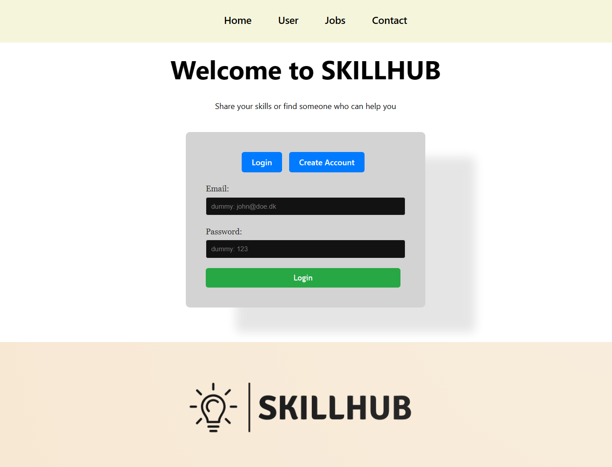

<p align="center">

</p>

# svelte SKILLHUB

> This is my examnproject for the Svelte course in my fourth semester of Computer Science at KEA.

> SKILLHUB is an easy-to-use job portal where you can post job opportunities or seek assistance with tasks. 

## Installation

1. CD into client and install the packages:

```
npm install
```
2. start the client:

```
npm run dev
```

3. CD into server and install the packages aswell.

4. Create a .env file (you can copy the .env.example file) and fill out the necessary values.
```
cp .env.example .env
```

4. run this script to create the local mongoDB database

```
npm run database-create
```
5. start the server:
```
node app.js
```