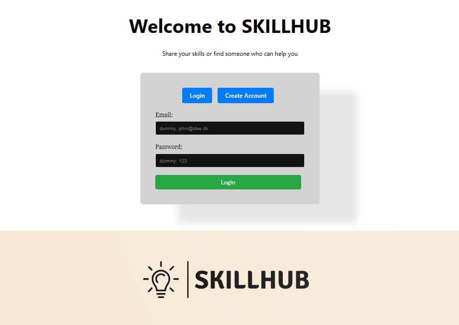

<p align="center">

</p>

# svelte SKILLHUB

> Midway Svelte project in my 4. semester studying Computer Science at KEA.

SKILLHUB is a simple job portal to post jobs you want to offer others or find help with a job. 

## Installation

1. CD into client and install the package with your favorite package manager:

```
npm install
```
2. start the client:

```
npm run dev
```

3. CD into server and install the package aswell.

4. run this script to create the local sqlite database

```
npm run database-create
```
5. start the server:
```
npm run dev
```