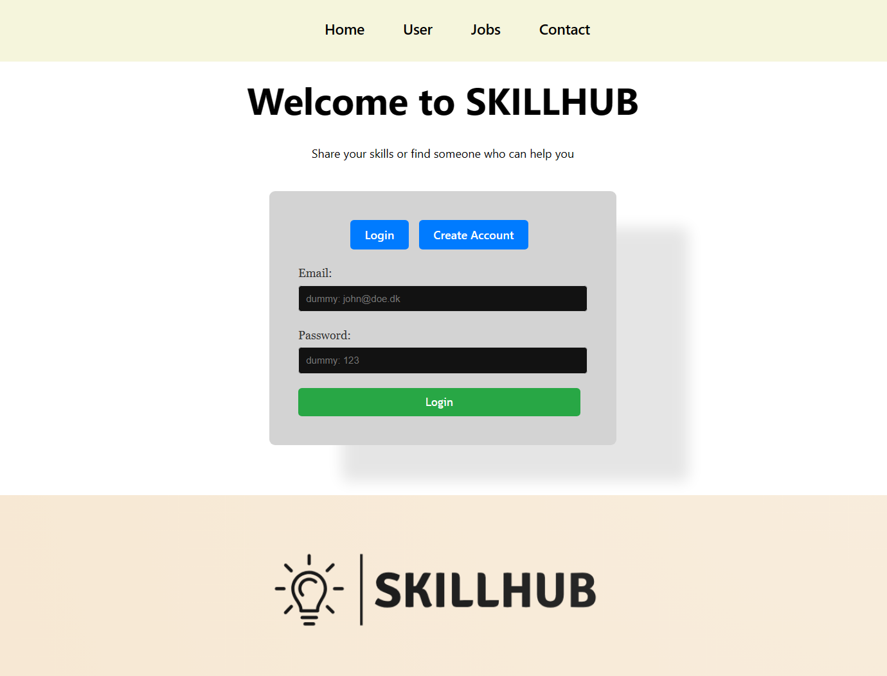

<p align="center">

</p>

# svelte SKILLHUB

> I am currently halfway through a Svelte project in my fourth semester of Computer Science studies at KEA.

> SKILLHUB is an easy-to-use job portal where you can post job opportunities or seek assistance with tasks. 

## Installation

1. CD into client and install the package:

```
npm install
```
2. start the client:

```
npm run dev
```

3. CD into server and install the package aswell.

4. run this script to create the local sqlite database

```
npm run database-create
```
5. start the server:
```
npm run dev
```